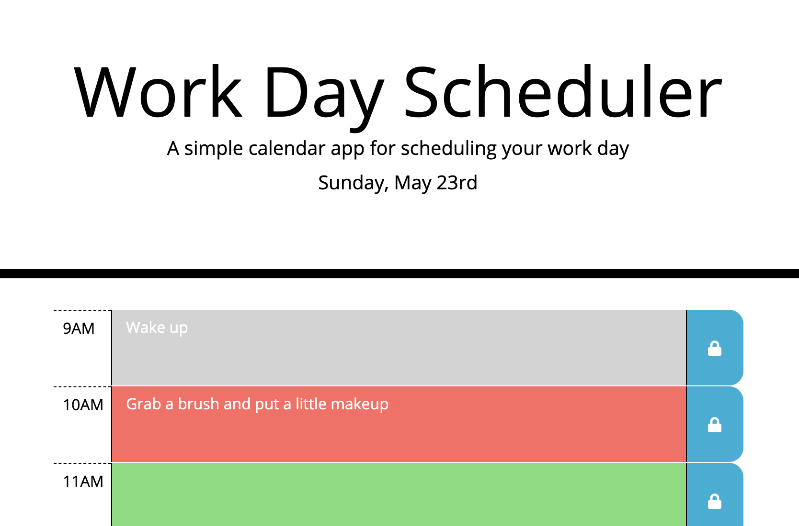

# Work Day Scheduler
A day planner for a standard work day

## Site Link

<https://twyllblackleaf.github.io/day-planner/>

## Features

- Displays the current date at the top of the page
- Highlights the current hour in red, the past in grey, and the future in green
- Saves tasks to, and loads from, local storage

## Technologies Used

- [jQuery](https://jquery.com/)
- [Bootstrap](https://getbootstrap.com/)
- [Moment.js](https://momentjs.com/)

## About Me

Kat Dixon is a developing developer with interests in accessibility, security, and the intersections between the two.